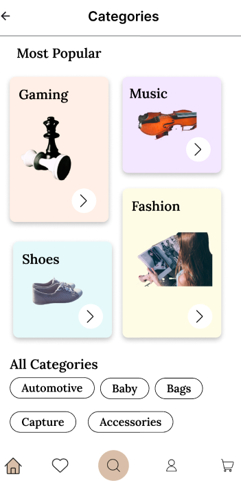
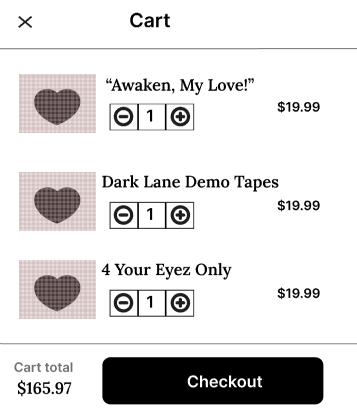
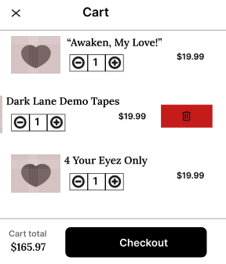

# Motion Microinteractions – Figma

## ✨ Project Highlights

### 🗂️ Categories  
Designed a layout to organize items by **categories** for easy browsing.

### 🛒 Cart Overlay  
- When the **overlay** opens, the **cart panel** slides in smoothly.  
- Clicking the ❌ **close button** hides the cart.

### 🧲 Drag & Delete Interaction  
- Users can **drag** a cart item, and a 🗑️ **delete icon** appears to remove the item.

---

## 🎥 Preview Video  
A video demo of all interactions is available on Google Drive:  
▶️ [Watch Preview Video](https://drive.google.com/file/d/1wfMobgDWXRq9D4WARxpbILZfAdy9iykK/view?usp=drive_link)

---

## 🎨 Design Preview (Images)

  
  

## 🎨 Figma Project
You can view the full design in Figma:
[🔗 Open Figma Design](https://www.figma.com/design/0MPzivObRQhXLQ899BBRYI/Figma-First-Project?node-id=62-2&t=Ayz62xA2w4PKk5xE-1)
